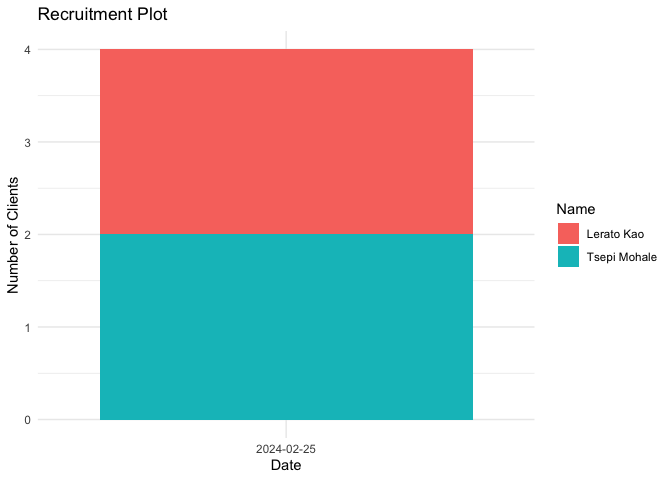
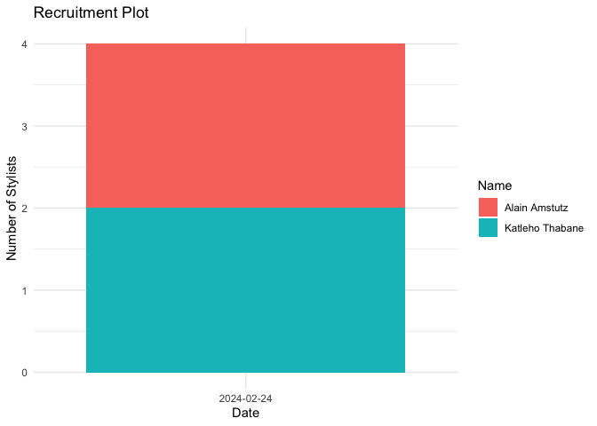

##############################################################################################
# PREPARATION
##############################################################################################
## Load packages

```r
library(tidyverse)
library(readxl)
library(writexl)
library(tableone)
library(here)
library(kableExtra)
library(ggplot2)

library(DT) # shiny app style table
library(formattable) # shiny app style table
library(leaflet) # gps map
```

## Load Data


## Create a few functions (activate URL links & mark duplicates), merge names, order dataframe

```r
# Create a function to activate the URL links
link_activator <- function(x) {
  sprintf('<a href="%s" target="_blank">%s</a>', x, x)
}
# Create a function to mark the duplicates in red, bold
dupl_checker <- formatter("span",
                          style = function(x) style(
                            color = ifelse(duplicated(x) == TRUE, "white", "black"),
                            background.color = ifelse(duplicated(x) == TRUE, "red", "white"),
                            font.weight = ifelse(duplicated(x) == TRUE, "bold", "normal")
                          ))

# Create a function to mark the duplicates in green, bold
dupl_checker_masterlist <- formatter("span",
                          style = function(x) style(
                            color = ifelse(duplicated(x) == TRUE, "white", "black"),
                            background.color = ifelse(duplicated(x) == TRUE, "green", "white"),
                            font.weight = ifelse(duplicated(x) == TRUE, "bold", "normal")
                          ))
# stylist registration
df_sr <- df_sr %>% mutate(fullname_s = paste(firstname_s, lastname_s, sep = " "))
df_sr <- df_sr %>% rename(submission_time_s = `_submission_time`)
df_sr <- df_sr[order(df_sr$submission_time_s, decreasing = TRUE), ]
df_sr$strange <- NA
df_sr$sent <- NA
df_sr$salon_pic_inside_s_URL <- sapply(df_sr$salon_pic_inside_s_URL, link_activator)
df_sr$salon_pic_outside_s_URL <- sapply(df_sr$salon_pic_outside_s_URL, link_activator)
df_sr$source <- "registration"

# stylist survey
df_ss <- df_ss %>% mutate(fullname_s = paste(firstname_s, lastname_s, sep = " "))
df_ss <- df_ss %>% rename(submission_time_s = `_submission_time`)
df_ss <- df_ss[order(df_ss$submission_time_s, decreasing = TRUE), ]
df_ss$strange <- NA
df_ss$sign_s_001_URL <- sapply(df_ss$sign_s_001_URL, link_activator)
df_ss$source <- "survey"

# client registration
df_cr <- df_cr %>% mutate(fullname_c = paste(firstname_c, lastname_c, sep = " "))
df_cr <- df_cr %>% mutate(fullname_s = paste(stylist_firstname_c, stylist_lastname_c, sep = " "))
df_cr <- df_cr %>% rename(submission_time_c = `_submission_time`)
df_cr <- df_cr[order(df_cr$submission_time_c, decreasing = TRUE), ]
df_cr$strange <- NA
df_cr$sent <- NA
df_cr$hair_pic_c_URL <- sapply(df_cr$hair_pic_c_URL, link_activator)
df_cr$source <- "registration"

# client survey
df_cs <- df_cs %>% mutate(fullname_c = paste(firstname_c, lastname_c, sep = " "))
df_cs <- df_cs %>% mutate(fullname_s = paste(stylist_firstname_c, stylist_lastname_c, sep = " "))
df_cs <- df_cs %>% rename(submission_time_c = `_submission_time`)
df_cs <- df_cs[order(df_cs$submission_time_c, decreasing = TRUE), ]
df_cs$strange <- NA
df_cs$sign_c_URL <- sapply(df_cs$sign_c_URL, link_activator)
df_cs$source <- "survey"
```

##############################################################################################
# STYLIST REGISTRATION
##############################################################################################
## Check GPS

```r
leaflet(data = df_sr) %>%
  addTiles() %>%
  addMarkers(~`_salon_gps_s_longitude`, ~`_salon_gps_s_latitude`, popup = ~fullname_s)
```

```{=html}
<div class="leaflet html-widget html-fill-item-overflow-hidden html-fill-item" id="htmlwidget-c56c2c98591059736646" style="width:672px;height:480px;"></div>
<script type="application/json" data-for="htmlwidget-c56c2c98591059736646">{"x":{"options":{"crs":{"crsClass":"L.CRS.EPSG3857","code":null,"proj4def":null,"projectedBounds":null,"options":{}}},"calls":[{"method":"addTiles","args":["https://{s}.tile.openstreetmap.org/{z}/{x}/{y}.png",null,null,{"minZoom":0,"maxZoom":18,"tileSize":256,"subdomains":"abc","errorTileUrl":"","tms":false,"noWrap":false,"zoomOffset":0,"zoomReverse":false,"opacity":1,"zIndex":1,"detectRetina":false,"attribution":"&copy; <a href=\"https://openstreetmap.org/copyright/\">OpenStreetMap<\/a>,  <a href=\"https://opendatacommons.org/licenses/odbl/\">ODbL<\/a>"}]},{"method":"addMarkers","args":[[47.050172,47.05012,47.050119],[8.310062,8.31008,8.31008],null,null,null,{"interactive":true,"draggable":false,"keyboard":true,"title":"","alt":"","zIndexOffset":0,"opacity":1,"riseOnHover":false,"riseOffset":250},["Alain Amstutz","Alain Amstutz","Katleho Thabane"],null,null,null,null,{"interactive":false,"permanent":false,"direction":"auto","opacity":1,"offset":[0,0],"textsize":"10px","textOnly":false,"className":"","sticky":true},null]}],"limits":{"lat":[47.050119,47.050172],"lng":[8.310062,8.31008]}},"evals":[],"jsHooks":[]}</script>
```
Note the name of any strange GPS (click on the arrow to see the name):
- 

## Check Duplicates, Pictures, and M-Pesa

```r
df_sr_check <- df_sr %>% 
    select(sent, strange, fullname_s, age_s, gender_s, whatsapp_s, mpesa_name_s, mpesa_s, salon_district_s, salon_name_desc_s, salon_address_s, salon_pic_outside_s_URL, salon_pic_inside_s_URL, submission_time_s)

# Create the table
as.datatable(formattable(df_sr_check, list(fullname_s = dupl_checker,
                                          mpesa_s = dupl_checker,
                                          whatsapp_s = dupl_checker)),
             rownames = FALSE,
             filter = "top",
             class = 'cell-border stripe',
             editable = TRUE,
             # extensions = 'Buttons'
             )
```

```{=html}
<div class="datatables html-widget html-fill-item-overflow-hidden html-fill-item" id="htmlwidget-c6927ef7cb7121573d82" style="width:100%;height:auto;"></div>
<script type="application/json" data-for="htmlwidget-c6927ef7cb7121573d82">{"x":{"filter":"top","vertical":false,"filterHTML":"<tr>\n  <td data-type=\"character\" style=\"vertical-align: top;\">\n    <div class=\"form-group has-feedback\" style=\"margin-bottom: auto;\">\n      <input type=\"search\" placeholder=\"All\" class=\"form-control\" style=\"width: 100%;\" disabled=\"\"/>\n      <span class=\"glyphicon glyphicon-remove-circle form-control-feedback\"><\/span>\n    <\/div>\n  <\/td>\n  <td data-type=\"character\" style=\"vertical-align: top;\">\n    <div class=\"form-group has-feedback\" style=\"margin-bottom: auto;\">\n      <input type=\"search\" placeholder=\"All\" class=\"form-control\" style=\"width: 100%;\" disabled=\"\"/>\n      <span class=\"glyphicon glyphicon-remove-circle form-control-feedback\"><\/span>\n    <\/div>\n  <\/td>\n  <td data-type=\"character\" style=\"vertical-align: top;\">\n    <div class=\"form-group has-feedback\" style=\"margin-bottom: auto;\">\n      <input type=\"search\" placeholder=\"All\" class=\"form-control\" style=\"width: 100%;\"/>\n      <span class=\"glyphicon glyphicon-remove-circle form-control-feedback\"><\/span>\n    <\/div>\n  <\/td>\n  <td data-type=\"character\" style=\"vertical-align: top;\">\n    <div class=\"form-group has-feedback\" style=\"margin-bottom: auto;\">\n      <input type=\"search\" placeholder=\"All\" class=\"form-control\" style=\"width: 100%;\"/>\n      <span class=\"glyphicon glyphicon-remove-circle form-control-feedback\"><\/span>\n    <\/div>\n  <\/td>\n  <td data-type=\"character\" style=\"vertical-align: top;\">\n    <div class=\"form-group has-feedback\" style=\"margin-bottom: auto;\">\n      <input type=\"search\" placeholder=\"All\" class=\"form-control\" style=\"width: 100%;\"/>\n      <span class=\"glyphicon glyphicon-remove-circle form-control-feedback\"><\/span>\n    <\/div>\n  <\/td>\n  <td data-type=\"character\" style=\"vertical-align: top;\">\n    <div class=\"form-group has-feedback\" style=\"margin-bottom: auto;\">\n      <input type=\"search\" placeholder=\"All\" class=\"form-control\" style=\"width: 100%;\"/>\n      <span class=\"glyphicon glyphicon-remove-circle form-control-feedback\"><\/span>\n    <\/div>\n  <\/td>\n  <td data-type=\"character\" style=\"vertical-align: top;\">\n    <div class=\"form-group has-feedback\" style=\"margin-bottom: auto;\">\n      <input type=\"search\" placeholder=\"All\" class=\"form-control\" style=\"width: 100%;\"/>\n      <span class=\"glyphicon glyphicon-remove-circle form-control-feedback\"><\/span>\n    <\/div>\n  <\/td>\n  <td data-type=\"character\" style=\"vertical-align: top;\">\n    <div class=\"form-group has-feedback\" style=\"margin-bottom: auto;\">\n      <input type=\"search\" placeholder=\"All\" class=\"form-control\" style=\"width: 100%;\"/>\n      <span class=\"glyphicon glyphicon-remove-circle form-control-feedback\"><\/span>\n    <\/div>\n  <\/td>\n  <td data-type=\"character\" style=\"vertical-align: top;\">\n    <div class=\"form-group has-feedback\" style=\"margin-bottom: auto;\">\n      <input type=\"search\" placeholder=\"All\" class=\"form-control\" style=\"width: 100%;\"/>\n      <span class=\"glyphicon glyphicon-remove-circle form-control-feedback\"><\/span>\n    <\/div>\n  <\/td>\n  <td data-type=\"character\" style=\"vertical-align: top;\">\n    <div class=\"form-group has-feedback\" style=\"margin-bottom: auto;\">\n      <input type=\"search\" placeholder=\"All\" class=\"form-control\" style=\"width: 100%;\"/>\n      <span class=\"glyphicon glyphicon-remove-circle form-control-feedback\"><\/span>\n    <\/div>\n  <\/td>\n  <td data-type=\"character\" style=\"vertical-align: top;\">\n    <div class=\"form-group has-feedback\" style=\"margin-bottom: auto;\">\n      <input type=\"search\" placeholder=\"All\" class=\"form-control\" style=\"width: 100%;\"/>\n      <span class=\"glyphicon glyphicon-remove-circle form-control-feedback\"><\/span>\n    <\/div>\n  <\/td>\n  <td data-type=\"character\" style=\"vertical-align: top;\">\n    <div class=\"form-group has-feedback\" style=\"margin-bottom: auto;\">\n      <input type=\"search\" placeholder=\"All\" class=\"form-control\" style=\"width: 100%;\"/>\n      <span class=\"glyphicon glyphicon-remove-circle form-control-feedback\"><\/span>\n    <\/div>\n  <\/td>\n  <td data-type=\"character\" style=\"vertical-align: top;\">\n    <div class=\"form-group has-feedback\" style=\"margin-bottom: auto;\">\n      <input type=\"search\" placeholder=\"All\" class=\"form-control\" style=\"width: 100%;\"/>\n      <span class=\"glyphicon glyphicon-remove-circle form-control-feedback\"><\/span>\n    <\/div>\n  <\/td>\n  <td data-type=\"character\" style=\"vertical-align: top;\">\n    <div class=\"form-group has-feedback\" style=\"margin-bottom: auto;\">\n      <input type=\"search\" placeholder=\"All\" class=\"form-control\" style=\"width: 100%;\"/>\n      <span class=\"glyphicon glyphicon-remove-circle form-control-feedback\"><\/span>\n    <\/div>\n  <\/td>\n<\/tr>","editable":{"target":"cell","disable":{"columns":null},"numeric":[],"date":[]},"data":[["NA","NA","NA"],["NA","NA","NA"],["<span style=\"color: black; background-color: white; font-weight: normal\">Alain Amstutz  <\/span>","<span style=\"color: white; background-color: red; font-weight: bold\">Alain Amstutz  <\/span>    ","<span style=\"color: black; background-color: white; font-weight: normal\">Katleho Thabane<\/span>"],["33","33","20"],["gender_s_man  ","gender_s_man  ","gender_s_woman"],["<span style=\"color: black; background-color: white; font-weight: normal\">12349876<\/span>","<span style=\"color: black; background-color: white; font-weight: normal\">12345678<\/span>","<span style=\"color: black; background-color: white; font-weight: normal\">12341234<\/span>"],["Alain Amstutz  ","Alain Amstutz  ","Katleho Thabane"],["<span style=\"color: black; background-color: white; font-weight: normal\">NA<\/span>","<span style=\"color: white; background-color: red; font-weight: bold\">NA<\/span>    ","<span style=\"color: white; background-color: red; font-weight: bold\">NA<\/span>    "],["salon_district_s_but","salon_district_s_but","salon_district_s_mas"],["NA           ","NA           ","Katy's beauty"],["bb taxi rank   ","bb taxi rank   ","Morija junction"],["<a href=\"https://kc.kobotoolbox.org/media/original?media_file=thehubatmorija%2Fattachments%2Fd85619df26744e138e9099d0e35233fe%2F344020e6-d385-466e-9f9c-0f4b556c701e%2FWhatsApp_Image_2024-02-22_at_09.21.25-22_29_44.jpeg\" target=\"_blank\">https://kc.kobotoolbox.org/media/original?media_file=thehubatmorija%2Fattachments%2Fd85619df26744e138e9099d0e35233fe%2F344020e6-d385-466e-9f9c-0f4b556c701e%2FWhatsApp_Image_2024-02-22_at_09.21.25-22_29_44.jpeg<\/a>","<a href=\"https://kc.kobotoolbox.org/media/original?media_file=thehubatmorija%2Fattachments%2Fd85619df26744e138e9099d0e35233fe%2Ff3970928-ae2e-459d-940d-00d1e092e5c0%2FWhatsApp_Image_2024-02-22_at_09.21.25-22_28_37.jpeg\" target=\"_blank\">https://kc.kobotoolbox.org/media/original?media_file=thehubatmorija%2Fattachments%2Fd85619df26744e138e9099d0e35233fe%2Ff3970928-ae2e-459d-940d-00d1e092e5c0%2FWhatsApp_Image_2024-02-22_at_09.21.25-22_28_37.jpeg<\/a>","<a href=\"https://kc.kobotoolbox.org/media/original?media_file=thehubatmorija%2Fattachments%2Fd85619df26744e138e9099d0e35233fe%2Fcb6945d6-b3b7-4dca-a584-6884b373fc28%2FWhatsApp_Image_2024-02-22_at_09.21.25-22_20_50.jpeg\" target=\"_blank\">https://kc.kobotoolbox.org/media/original?media_file=thehubatmorija%2Fattachments%2Fd85619df26744e138e9099d0e35233fe%2Fcb6945d6-b3b7-4dca-a584-6884b373fc28%2FWhatsApp_Image_2024-02-22_at_09.21.25-22_20_50.jpeg<\/a>"],["<a href=\"https://kc.kobotoolbox.org/media/original?media_file=thehubatmorija%2Fattachments%2Fd85619df26744e138e9099d0e35233fe%2F344020e6-d385-466e-9f9c-0f4b556c701e%2FWhatsApp_Image_2024-02-22_at_09.21.25-22_29_49.jpeg\" target=\"_blank\">https://kc.kobotoolbox.org/media/original?media_file=thehubatmorija%2Fattachments%2Fd85619df26744e138e9099d0e35233fe%2F344020e6-d385-466e-9f9c-0f4b556c701e%2FWhatsApp_Image_2024-02-22_at_09.21.25-22_29_49.jpeg<\/a>","<a href=\"https://kc.kobotoolbox.org/media/original?media_file=thehubatmorija%2Fattachments%2Fd85619df26744e138e9099d0e35233fe%2Ff3970928-ae2e-459d-940d-00d1e092e5c0%2FWhatsApp_Image_2024-02-22_at_09.21.25-22_28_41.jpeg\" target=\"_blank\">https://kc.kobotoolbox.org/media/original?media_file=thehubatmorija%2Fattachments%2Fd85619df26744e138e9099d0e35233fe%2Ff3970928-ae2e-459d-940d-00d1e092e5c0%2FWhatsApp_Image_2024-02-22_at_09.21.25-22_28_41.jpeg<\/a>","<a href=\"https://kc.kobotoolbox.org/media/original?media_file=thehubatmorija%2Fattachments%2Fd85619df26744e138e9099d0e35233fe%2Fcb6945d6-b3b7-4dca-a584-6884b373fc28%2FWhatsApp_Image_2024-02-22_at_09.21.25-22_20_56.jpeg\" target=\"_blank\">https://kc.kobotoolbox.org/media/original?media_file=thehubatmorija%2Fattachments%2Fd85619df26744e138e9099d0e35233fe%2Fcb6945d6-b3b7-4dca-a584-6884b373fc28%2FWhatsApp_Image_2024-02-22_at_09.21.25-22_20_56.jpeg<\/a>"],["2024-02-24 21:29:53","2024-02-24 21:28:49","2024-02-24 21:21:05"]],"container":"<table class=\"cell-border stripe\">\n  <thead>\n    <tr>\n      <th>sent<\/th>\n      <th>strange<\/th>\n      <th>fullname_s<\/th>\n      <th>age_s<\/th>\n      <th>gender_s<\/th>\n      <th>whatsapp_s<\/th>\n      <th>mpesa_name_s<\/th>\n      <th>mpesa_s<\/th>\n      <th>salon_district_s<\/th>\n      <th>salon_name_desc_s<\/th>\n      <th>salon_address_s<\/th>\n      <th>salon_pic_outside_s_URL<\/th>\n      <th>salon_pic_inside_s_URL<\/th>\n      <th>submission_time_s<\/th>\n    <\/tr>\n  <\/thead>\n<\/table>","options":{"columnDefs":[{"name":"sent","targets":0},{"name":"strange","targets":1},{"name":"fullname_s","targets":2},{"name":"age_s","targets":3},{"name":"gender_s","targets":4},{"name":"whatsapp_s","targets":5},{"name":"mpesa_name_s","targets":6},{"name":"mpesa_s","targets":7},{"name":"salon_district_s","targets":8},{"name":"salon_name_desc_s","targets":9},{"name":"salon_address_s","targets":10},{"name":"salon_pic_outside_s_URL","targets":11},{"name":"salon_pic_inside_s_URL","targets":12},{"name":"submission_time_s","targets":13}],"order":[],"autoWidth":false,"orderClasses":false,"orderCellsTop":true}},"evals":[],"jsHooks":[]}</script>
```

```r
# write_xlsx(df_sr, path = "df_sr.xlsx")
```
Duplicates are marked in bold red, based on fullname, mpesa number and whatsapp number
Note the name of any duplicate:
-

Note the name of any strange pictures:
- 

Note the name of any M-Pesa that did not match:
- 

###########
Send to all verified Stylists, via their WhatsApp, the consent form PDF and the Stylist survey link
###########

Note until which name you verified the Pictures and M-Pesa, and sent the material: 


##############################################################################################
# STYLIST SURVEY
##############################################################################################
## Check Duplicates and Signature

```r
df_ss_check <- df_ss %>% 
    select(strange, fullname_s, age_s, gender_s, whatsapp_s, salon_district_s, sign_s_001_URL, submission_time_s)

# Create the table
as.datatable(formattable(df_ss_check, list(fullname_s = dupl_checker,
                                          whatsapp_s = dupl_checker)),
             rownames = FALSE,
             filter = "top",
             class = 'cell-border stripe',
             editable = TRUE,
             )
```

```{=html}
<div class="datatables html-widget html-fill-item-overflow-hidden html-fill-item" id="htmlwidget-eba9e5db6a80080d4303" style="width:100%;height:auto;"></div>
<script type="application/json" data-for="htmlwidget-eba9e5db6a80080d4303">{"x":{"filter":"top","vertical":false,"filterHTML":"<tr>\n  <td data-type=\"character\" style=\"vertical-align: top;\">\n    <div class=\"form-group has-feedback\" style=\"margin-bottom: auto;\">\n      <input type=\"search\" placeholder=\"All\" class=\"form-control\" style=\"width: 100%;\" disabled=\"\"/>\n      <span class=\"glyphicon glyphicon-remove-circle form-control-feedback\"><\/span>\n    <\/div>\n  <\/td>\n  <td data-type=\"character\" style=\"vertical-align: top;\">\n    <div class=\"form-group has-feedback\" style=\"margin-bottom: auto;\">\n      <input type=\"search\" placeholder=\"All\" class=\"form-control\" style=\"width: 100%;\"/>\n      <span class=\"glyphicon glyphicon-remove-circle form-control-feedback\"><\/span>\n    <\/div>\n  <\/td>\n  <td data-type=\"character\" style=\"vertical-align: top;\">\n    <div class=\"form-group has-feedback\" style=\"margin-bottom: auto;\">\n      <input type=\"search\" placeholder=\"All\" class=\"form-control\" style=\"width: 100%;\"/>\n      <span class=\"glyphicon glyphicon-remove-circle form-control-feedback\"><\/span>\n    <\/div>\n  <\/td>\n  <td data-type=\"character\" style=\"vertical-align: top;\">\n    <div class=\"form-group has-feedback\" style=\"margin-bottom: auto;\">\n      <input type=\"search\" placeholder=\"All\" class=\"form-control\" style=\"width: 100%;\"/>\n      <span class=\"glyphicon glyphicon-remove-circle form-control-feedback\"><\/span>\n    <\/div>\n  <\/td>\n  <td data-type=\"character\" style=\"vertical-align: top;\">\n    <div class=\"form-group has-feedback\" style=\"margin-bottom: auto;\">\n      <input type=\"search\" placeholder=\"All\" class=\"form-control\" style=\"width: 100%;\"/>\n      <span class=\"glyphicon glyphicon-remove-circle form-control-feedback\"><\/span>\n    <\/div>\n  <\/td>\n  <td data-type=\"character\" style=\"vertical-align: top;\">\n    <div class=\"form-group has-feedback\" style=\"margin-bottom: auto;\">\n      <input type=\"search\" placeholder=\"All\" class=\"form-control\" style=\"width: 100%;\"/>\n      <span class=\"glyphicon glyphicon-remove-circle form-control-feedback\"><\/span>\n    <\/div>\n  <\/td>\n  <td data-type=\"character\" style=\"vertical-align: top;\">\n    <div class=\"form-group has-feedback\" style=\"margin-bottom: auto;\">\n      <input type=\"search\" placeholder=\"All\" class=\"form-control\" style=\"width: 100%;\"/>\n      <span class=\"glyphicon glyphicon-remove-circle form-control-feedback\"><\/span>\n    <\/div>\n  <\/td>\n  <td data-type=\"character\" style=\"vertical-align: top;\">\n    <div class=\"form-group has-feedback\" style=\"margin-bottom: auto;\">\n      <input type=\"search\" placeholder=\"All\" class=\"form-control\" style=\"width: 100%;\"/>\n      <span class=\"glyphicon glyphicon-remove-circle form-control-feedback\"><\/span>\n    <\/div>\n  <\/td>\n<\/tr>","editable":{"target":"cell","disable":{"columns":null},"numeric":[],"date":[]},"data":[["NA","NA","NA"],["<span style=\"color: black; background-color: white; font-weight: normal\">Alain Amstutz  <\/span>","<span style=\"color: black; background-color: white; font-weight: normal\">Katleho Thabane<\/span>","<span style=\"color: black; background-color: white; font-weight: normal\">#fname NA      <\/span>"],["33","20","NA"],["gender_s_man  ","gender_s_woman","NA            "],["<span style=\"color: black; background-color: white; font-weight: normal\">12349876<\/span>","<span style=\"color: black; background-color: white; font-weight: normal\">12341234<\/span>","<span style=\"color: black; background-color: white; font-weight: normal\">NA<\/span>      "],["salon_district_s_but","salon_district_s_mas","NA                  "],["<a href=\"https://kc.kobotoolbox.org/media/original?media_file=thehubatmorija%2Fattachments%2Fb525e69dec824a21b3da6743823e0a66%2Fe32eee3a-d191-4127-9437-f523307f41e1%2Fsignature-22_31_31.png\" target=\"_blank\">https://kc.kobotoolbox.org/media/original?media_file=thehubatmorija%2Fattachments%2Fb525e69dec824a21b3da6743823e0a66%2Fe32eee3a-d191-4127-9437-f523307f41e1%2Fsignature-22_31_31.png<\/a>","<a href=\"https://kc.kobotoolbox.org/media/original?media_file=thehubatmorija%2Fattachments%2Fb525e69dec824a21b3da6743823e0a66%2F870136eb-f7cf-4b12-b151-b06e76d383a8%2Fsignature-22_23_25.png\" target=\"_blank\">https://kc.kobotoolbox.org/media/original?media_file=thehubatmorija%2Fattachments%2Fb525e69dec824a21b3da6743823e0a66%2F870136eb-f7cf-4b12-b151-b06e76d383a8%2Fsignature-22_23_25.png<\/a>","<a href=\"NA\" target=\"_blank\">NA<\/a>                                                                                                                                                                                                                                                                                                                                                                    "],["2024-02-24 21:31:33","2024-02-24 21:23:27",null]],"container":"<table class=\"cell-border stripe\">\n  <thead>\n    <tr>\n      <th>strange<\/th>\n      <th>fullname_s<\/th>\n      <th>age_s<\/th>\n      <th>gender_s<\/th>\n      <th>whatsapp_s<\/th>\n      <th>salon_district_s<\/th>\n      <th>sign_s_001_URL<\/th>\n      <th>submission_time_s<\/th>\n    <\/tr>\n  <\/thead>\n<\/table>","options":{"columnDefs":[{"name":"strange","targets":0},{"name":"fullname_s","targets":1},{"name":"age_s","targets":2},{"name":"gender_s","targets":3},{"name":"whatsapp_s","targets":4},{"name":"salon_district_s","targets":5},{"name":"sign_s_001_URL","targets":6},{"name":"submission_time_s","targets":7}],"order":[],"autoWidth":false,"orderClasses":false,"orderCellsTop":true}},"evals":[],"jsHooks":[]}</script>
```
Duplicates are marked in bold red, based on fullname and whatsapp number
Note the name of any duplicate:
- 
Note the name of any strange signature picture:
- 

## Link Stylist Survey to Stylist Registration

```r
df_ss_linkage <- df_ss %>% 
    select(source, strange, fullname_s, age_s, gender_s, whatsapp_s, salon_district_s, submission_time_s)
df_sr_linkage <- df_sr %>% 
    select(source, strange, fullname_s, age_s, gender_s, whatsapp_s, salon_district_s, submission_time_s)

df_sr_ss <- rbind(df_ss_linkage, df_sr_linkage)
df_sr_ss <- df_sr_ss[order(df_sr_ss$fullname_s, decreasing = TRUE), ]
df_sr_ss$reminder_sent <- NA

df_sr_ss <- df_sr_ss %>% 
    select(reminder_sent, source, fullname_s, age_s, gender_s, whatsapp_s, salon_district_s, submission_time_s)

# Create the table
as.datatable(formattable(df_sr_ss, list(fullname_s = dupl_checker_masterlist,
                                        whatsapp_s = dupl_checker_masterlist)),
             rownames = FALSE,
             filter = "top",
             class = 'cell-border stripe',
             editable = TRUE,
             )
```

```{=html}
<div class="datatables html-widget html-fill-item-overflow-hidden html-fill-item" id="htmlwidget-b2cbac6871a1f985584e" style="width:100%;height:auto;"></div>
<script type="application/json" data-for="htmlwidget-b2cbac6871a1f985584e">{"x":{"filter":"top","vertical":false,"filterHTML":"<tr>\n  <td data-type=\"character\" style=\"vertical-align: top;\">\n    <div class=\"form-group has-feedback\" style=\"margin-bottom: auto;\">\n      <input type=\"search\" placeholder=\"All\" class=\"form-control\" style=\"width: 100%;\" disabled=\"\"/>\n      <span class=\"glyphicon glyphicon-remove-circle form-control-feedback\"><\/span>\n    <\/div>\n  <\/td>\n  <td data-type=\"character\" style=\"vertical-align: top;\">\n    <div class=\"form-group has-feedback\" style=\"margin-bottom: auto;\">\n      <input type=\"search\" placeholder=\"All\" class=\"form-control\" style=\"width: 100%;\"/>\n      <span class=\"glyphicon glyphicon-remove-circle form-control-feedback\"><\/span>\n    <\/div>\n  <\/td>\n  <td data-type=\"character\" style=\"vertical-align: top;\">\n    <div class=\"form-group has-feedback\" style=\"margin-bottom: auto;\">\n      <input type=\"search\" placeholder=\"All\" class=\"form-control\" style=\"width: 100%;\"/>\n      <span class=\"glyphicon glyphicon-remove-circle form-control-feedback\"><\/span>\n    <\/div>\n  <\/td>\n  <td data-type=\"character\" style=\"vertical-align: top;\">\n    <div class=\"form-group has-feedback\" style=\"margin-bottom: auto;\">\n      <input type=\"search\" placeholder=\"All\" class=\"form-control\" style=\"width: 100%;\"/>\n      <span class=\"glyphicon glyphicon-remove-circle form-control-feedback\"><\/span>\n    <\/div>\n  <\/td>\n  <td data-type=\"character\" style=\"vertical-align: top;\">\n    <div class=\"form-group has-feedback\" style=\"margin-bottom: auto;\">\n      <input type=\"search\" placeholder=\"All\" class=\"form-control\" style=\"width: 100%;\"/>\n      <span class=\"glyphicon glyphicon-remove-circle form-control-feedback\"><\/span>\n    <\/div>\n  <\/td>\n  <td data-type=\"character\" style=\"vertical-align: top;\">\n    <div class=\"form-group has-feedback\" style=\"margin-bottom: auto;\">\n      <input type=\"search\" placeholder=\"All\" class=\"form-control\" style=\"width: 100%;\"/>\n      <span class=\"glyphicon glyphicon-remove-circle form-control-feedback\"><\/span>\n    <\/div>\n  <\/td>\n  <td data-type=\"character\" style=\"vertical-align: top;\">\n    <div class=\"form-group has-feedback\" style=\"margin-bottom: auto;\">\n      <input type=\"search\" placeholder=\"All\" class=\"form-control\" style=\"width: 100%;\"/>\n      <span class=\"glyphicon glyphicon-remove-circle form-control-feedback\"><\/span>\n    <\/div>\n  <\/td>\n  <td data-type=\"character\" style=\"vertical-align: top;\">\n    <div class=\"form-group has-feedback\" style=\"margin-bottom: auto;\">\n      <input type=\"search\" placeholder=\"All\" class=\"form-control\" style=\"width: 100%;\"/>\n      <span class=\"glyphicon glyphicon-remove-circle form-control-feedback\"><\/span>\n    <\/div>\n  <\/td>\n<\/tr>","editable":{"target":"cell","disable":{"columns":null},"numeric":[],"date":[]},"data":[["NA","NA","NA","NA","NA","NA"],["survey      ","registration","survey      ","registration","registration","survey      "],["<span style=\"color: black; background-color: white; font-weight: normal\">Katleho Thabane<\/span>","<span style=\"color: white; background-color: green; font-weight: bold\">Katleho Thabane<\/span>  ","<span style=\"color: black; background-color: white; font-weight: normal\">Alain Amstutz  <\/span>","<span style=\"color: white; background-color: green; font-weight: bold\">Alain Amstutz  <\/span>  ","<span style=\"color: white; background-color: green; font-weight: bold\">Alain Amstutz  <\/span>  ","<span style=\"color: black; background-color: white; font-weight: normal\">#fname NA      <\/span>"],["20","20","33","33","33","NA"],["gender_s_woman","gender_s_woman","gender_s_man  ","gender_s_man  ","gender_s_man  ","NA            "],["<span style=\"color: black; background-color: white; font-weight: normal\">12341234<\/span>","<span style=\"color: white; background-color: green; font-weight: bold\">12341234<\/span>  ","<span style=\"color: black; background-color: white; font-weight: normal\">12349876<\/span>","<span style=\"color: white; background-color: green; font-weight: bold\">12349876<\/span>  ","<span style=\"color: black; background-color: white; font-weight: normal\">12345678<\/span>","<span style=\"color: black; background-color: white; font-weight: normal\">NA<\/span>      "],["salon_district_s_mas","salon_district_s_mas","salon_district_s_but","salon_district_s_but","salon_district_s_but","NA                  "],["2024-02-24 21:23:27","2024-02-24 21:21:05","2024-02-24 21:31:33","2024-02-24 21:29:53","2024-02-24 21:28:49",null]],"container":"<table class=\"cell-border stripe\">\n  <thead>\n    <tr>\n      <th>reminder_sent<\/th>\n      <th>source<\/th>\n      <th>fullname_s<\/th>\n      <th>age_s<\/th>\n      <th>gender_s<\/th>\n      <th>whatsapp_s<\/th>\n      <th>salon_district_s<\/th>\n      <th>submission_time_s<\/th>\n    <\/tr>\n  <\/thead>\n<\/table>","options":{"columnDefs":[{"name":"reminder_sent","targets":0},{"name":"source","targets":1},{"name":"fullname_s","targets":2},{"name":"age_s","targets":3},{"name":"gender_s","targets":4},{"name":"whatsapp_s","targets":5},{"name":"salon_district_s","targets":6},{"name":"submission_time_s","targets":7}],"order":[],"autoWidth":false,"orderClasses":false,"orderCellsTop":true}},"evals":[],"jsHooks":[]}</script>
```
Each Stylist should have her/his name in duplicate (bold green), once from the registration form and once from the survey

Note the name of those Stylists with a registration, but missing survey:
- 


##############################################################################################
##############################################################################################
# CLIENT REGISTRATION
##############################################################################################
## Check GPS

```r
leaflet(data = df_cr) %>%
  addTiles() %>%
  addMarkers(~`_salon_gps_c_longitude`, ~`_salon_gps_c_latitude`, popup = ~fullname_c)
```

```{=html}
<div class="leaflet html-widget html-fill-item-overflow-hidden html-fill-item" id="htmlwidget-ad4ad1678d7b7fff3b07" style="width:672px;height:480px;"></div>
<script type="application/json" data-for="htmlwidget-ad4ad1678d7b7fff3b07">{"x":{"options":{"crs":{"crsClass":"L.CRS.EPSG3857","code":null,"proj4def":null,"projectedBounds":null,"options":{}}},"calls":[{"method":"addTiles","args":["https://{s}.tile.openstreetmap.org/{z}/{x}/{y}.png",null,null,{"minZoom":0,"maxZoom":18,"tileSize":256,"subdomains":"abc","errorTileUrl":"","tms":false,"noWrap":false,"zoomOffset":0,"zoomReverse":false,"opacity":1,"zIndex":1,"detectRetina":false,"attribution":"&copy; <a href=\"https://openstreetmap.org/copyright/\">OpenStreetMap<\/a>,  <a href=\"https://opendatacommons.org/licenses/odbl/\">ODbL<\/a>"}]},{"method":"addMarkers","args":[[47.120738,47.120752,47.120771],[8.397923,8.397888,8.397916],null,null,null,{"interactive":true,"draggable":false,"keyboard":true,"title":"","alt":"","zIndexOffset":0,"opacity":1,"riseOnHover":false,"riseOffset":250},["Lerato Kao","Tsepi Mohale","Tsepi Mohale"],null,null,null,null,{"interactive":false,"permanent":false,"direction":"auto","opacity":1,"offset":[0,0],"textsize":"10px","textOnly":false,"className":"","sticky":true},null]}],"limits":{"lat":[47.120738,47.120771],"lng":[8.397888,8.397923]}},"evals":[],"jsHooks":[]}</script>
```
Note the name of any strange GPS (click on the arrow to see the name):
- 

## Check Duplicates, Pictures, and M-Pesa

```r
df_cr_check <- df_cr %>% 
    select(sent, strange, fullname_c, age_c, gender_c, whatsapp_c, mpesa_name_c, mpesa_c, salon_district_c, salon_name_desc_c, salon_address_c, fullname_s, hair_pic_c_URL, submission_time_c)

# Create the table
as.datatable(formattable(df_cr_check, list(fullname_c = dupl_checker,
                                          mpesa_c = dupl_checker,
                                          whatsapp_c = dupl_checker)),
             rownames = FALSE,
             filter = "top",
             class = 'cell-border stripe',
             editable = TRUE,
             )
```

```{=html}
<div class="datatables html-widget html-fill-item-overflow-hidden html-fill-item" id="htmlwidget-cbaa8801171de950dfcb" style="width:100%;height:auto;"></div>
<script type="application/json" data-for="htmlwidget-cbaa8801171de950dfcb">{"x":{"filter":"top","vertical":false,"filterHTML":"<tr>\n  <td data-type=\"character\" style=\"vertical-align: top;\">\n    <div class=\"form-group has-feedback\" style=\"margin-bottom: auto;\">\n      <input type=\"search\" placeholder=\"All\" class=\"form-control\" style=\"width: 100%;\" disabled=\"\"/>\n      <span class=\"glyphicon glyphicon-remove-circle form-control-feedback\"><\/span>\n    <\/div>\n  <\/td>\n  <td data-type=\"character\" style=\"vertical-align: top;\">\n    <div class=\"form-group has-feedback\" style=\"margin-bottom: auto;\">\n      <input type=\"search\" placeholder=\"All\" class=\"form-control\" style=\"width: 100%;\" disabled=\"\"/>\n      <span class=\"glyphicon glyphicon-remove-circle form-control-feedback\"><\/span>\n    <\/div>\n  <\/td>\n  <td data-type=\"character\" style=\"vertical-align: top;\">\n    <div class=\"form-group has-feedback\" style=\"margin-bottom: auto;\">\n      <input type=\"search\" placeholder=\"All\" class=\"form-control\" style=\"width: 100%;\"/>\n      <span class=\"glyphicon glyphicon-remove-circle form-control-feedback\"><\/span>\n    <\/div>\n  <\/td>\n  <td data-type=\"character\" style=\"vertical-align: top;\">\n    <div class=\"form-group has-feedback\" style=\"margin-bottom: auto;\">\n      <input type=\"search\" placeholder=\"All\" class=\"form-control\" style=\"width: 100%;\"/>\n      <span class=\"glyphicon glyphicon-remove-circle form-control-feedback\"><\/span>\n    <\/div>\n  <\/td>\n  <td data-type=\"character\" style=\"vertical-align: top;\">\n    <div class=\"form-group has-feedback\" style=\"margin-bottom: auto;\">\n      <input type=\"search\" placeholder=\"All\" class=\"form-control\" style=\"width: 100%;\" disabled=\"\"/>\n      <span class=\"glyphicon glyphicon-remove-circle form-control-feedback\"><\/span>\n    <\/div>\n  <\/td>\n  <td data-type=\"character\" style=\"vertical-align: top;\">\n    <div class=\"form-group has-feedback\" style=\"margin-bottom: auto;\">\n      <input type=\"search\" placeholder=\"All\" class=\"form-control\" style=\"width: 100%;\"/>\n      <span class=\"glyphicon glyphicon-remove-circle form-control-feedback\"><\/span>\n    <\/div>\n  <\/td>\n  <td data-type=\"character\" style=\"vertical-align: top;\">\n    <div class=\"form-group has-feedback\" style=\"margin-bottom: auto;\">\n      <input type=\"search\" placeholder=\"All\" class=\"form-control\" style=\"width: 100%;\"/>\n      <span class=\"glyphicon glyphicon-remove-circle form-control-feedback\"><\/span>\n    <\/div>\n  <\/td>\n  <td data-type=\"character\" style=\"vertical-align: top;\">\n    <div class=\"form-group has-feedback\" style=\"margin-bottom: auto;\">\n      <input type=\"search\" placeholder=\"All\" class=\"form-control\" style=\"width: 100%;\"/>\n      <span class=\"glyphicon glyphicon-remove-circle form-control-feedback\"><\/span>\n    <\/div>\n  <\/td>\n  <td data-type=\"character\" style=\"vertical-align: top;\">\n    <div class=\"form-group has-feedback\" style=\"margin-bottom: auto;\">\n      <input type=\"search\" placeholder=\"All\" class=\"form-control\" style=\"width: 100%;\"/>\n      <span class=\"glyphicon glyphicon-remove-circle form-control-feedback\"><\/span>\n    <\/div>\n  <\/td>\n  <td data-type=\"character\" style=\"vertical-align: top;\">\n    <div class=\"form-group has-feedback\" style=\"margin-bottom: auto;\">\n      <input type=\"search\" placeholder=\"All\" class=\"form-control\" style=\"width: 100%;\" disabled=\"\"/>\n      <span class=\"glyphicon glyphicon-remove-circle form-control-feedback\"><\/span>\n    <\/div>\n  <\/td>\n  <td data-type=\"character\" style=\"vertical-align: top;\">\n    <div class=\"form-group has-feedback\" style=\"margin-bottom: auto;\">\n      <input type=\"search\" placeholder=\"All\" class=\"form-control\" style=\"width: 100%;\"/>\n      <span class=\"glyphicon glyphicon-remove-circle form-control-feedback\"><\/span>\n    <\/div>\n  <\/td>\n  <td data-type=\"character\" style=\"vertical-align: top;\">\n    <div class=\"form-group has-feedback\" style=\"margin-bottom: auto;\">\n      <input type=\"search\" placeholder=\"All\" class=\"form-control\" style=\"width: 100%;\"/>\n      <span class=\"glyphicon glyphicon-remove-circle form-control-feedback\"><\/span>\n    <\/div>\n  <\/td>\n  <td data-type=\"character\" style=\"vertical-align: top;\">\n    <div class=\"form-group has-feedback\" style=\"margin-bottom: auto;\">\n      <input type=\"search\" placeholder=\"All\" class=\"form-control\" style=\"width: 100%;\"/>\n      <span class=\"glyphicon glyphicon-remove-circle form-control-feedback\"><\/span>\n    <\/div>\n  <\/td>\n  <td data-type=\"character\" style=\"vertical-align: top;\">\n    <div class=\"form-group has-feedback\" style=\"margin-bottom: auto;\">\n      <input type=\"search\" placeholder=\"All\" class=\"form-control\" style=\"width: 100%;\"/>\n      <span class=\"glyphicon glyphicon-remove-circle form-control-feedback\"><\/span>\n    <\/div>\n  <\/td>\n<\/tr>","editable":{"target":"cell","disable":{"columns":null},"numeric":[],"date":[]},"data":[["NA","NA","NA"],["NA","NA","NA"],["<span style=\"color: black; background-color: white; font-weight: normal\">Lerato Kao  <\/span>","<span style=\"color: black; background-color: white; font-weight: normal\">Tsepi Mohale<\/span>","<span style=\"color: white; background-color: red; font-weight: bold\">Tsepi Mohale<\/span>    "],["20","20","19"],["gender_c_woman","gender_c_woman","gender_c_woman"],["<span style=\"color: black; background-color: white; font-weight: normal\">9876543<\/span> ","<span style=\"color: black; background-color: white; font-weight: normal\">78999877<\/span>","<span style=\"color: black; background-color: white; font-weight: normal\">58604300<\/span>"],["Lerato Kao  ","Tsepi Mohale","Tsepi Mohale"],["<span style=\"color: black; background-color: white; font-weight: normal\">9876543<\/span> ","<span style=\"color: black; background-color: white; font-weight: normal\">78999877<\/span>","<span style=\"color: black; background-color: white; font-weight: normal\">58604300<\/span>"],["salon_district_c_but","salon_district_c_mas","salon_district_c_mas"],["NA","NA","NA"],["bb taxi rank   ","morija junction","morija junction"],["Alain Amstutz  ","Katleho Thabane","Katleho Thabane"],["<a href=\"https://kc.kobotoolbox.org/media/original?media_file=thehubatmorija%2Fattachments%2F93b895b18f8f4dcd80b8da6950536227%2F3db180c4-6392-40fd-bb6d-a8ee58f84549%2FWhatsApp_Image_2024-02-22_at_09.21.25-10_40_26.jpeg\" target=\"_blank\">https://kc.kobotoolbox.org/media/original?media_file=thehubatmorija%2Fattachments%2F93b895b18f8f4dcd80b8da6950536227%2F3db180c4-6392-40fd-bb6d-a8ee58f84549%2FWhatsApp_Image_2024-02-22_at_09.21.25-10_40_26.jpeg<\/a>","<a href=\"https://kc.kobotoolbox.org/media/original?media_file=thehubatmorija%2Fattachments%2F93b895b18f8f4dcd80b8da6950536227%2Ffd231d8e-bd5d-40aa-9db2-55a5129cb842%2FWhatsApp_Image_2024-02-22_at_09.21.25-10_38_36.jpeg\" target=\"_blank\">https://kc.kobotoolbox.org/media/original?media_file=thehubatmorija%2Fattachments%2F93b895b18f8f4dcd80b8da6950536227%2Ffd231d8e-bd5d-40aa-9db2-55a5129cb842%2FWhatsApp_Image_2024-02-22_at_09.21.25-10_38_36.jpeg<\/a>","<a href=\"https://kc.kobotoolbox.org/media/original?media_file=thehubatmorija%2Fattachments%2F93b895b18f8f4dcd80b8da6950536227%2F71177b7a-c55a-47b1-a47b-f186799911b6%2FWhatsApp_Image_2024-02-22_at_09.21.25-10_35_16.jpeg\" target=\"_blank\">https://kc.kobotoolbox.org/media/original?media_file=thehubatmorija%2Fattachments%2F93b895b18f8f4dcd80b8da6950536227%2F71177b7a-c55a-47b1-a47b-f186799911b6%2FWhatsApp_Image_2024-02-22_at_09.21.25-10_35_16.jpeg<\/a>"],["2024-02-25 09:40:31","2024-02-25 09:38:43","2024-02-25 09:35:44"]],"container":"<table class=\"cell-border stripe\">\n  <thead>\n    <tr>\n      <th>sent<\/th>\n      <th>strange<\/th>\n      <th>fullname_c<\/th>\n      <th>age_c<\/th>\n      <th>gender_c<\/th>\n      <th>whatsapp_c<\/th>\n      <th>mpesa_name_c<\/th>\n      <th>mpesa_c<\/th>\n      <th>salon_district_c<\/th>\n      <th>salon_name_desc_c<\/th>\n      <th>salon_address_c<\/th>\n      <th>fullname_s<\/th>\n      <th>hair_pic_c_URL<\/th>\n      <th>submission_time_c<\/th>\n    <\/tr>\n  <\/thead>\n<\/table>","options":{"columnDefs":[{"name":"sent","targets":0},{"name":"strange","targets":1},{"name":"fullname_c","targets":2},{"name":"age_c","targets":3},{"name":"gender_c","targets":4},{"name":"whatsapp_c","targets":5},{"name":"mpesa_name_c","targets":6},{"name":"mpesa_c","targets":7},{"name":"salon_district_c","targets":8},{"name":"salon_name_desc_c","targets":9},{"name":"salon_address_c","targets":10},{"name":"fullname_s","targets":11},{"name":"hair_pic_c_URL","targets":12},{"name":"submission_time_c","targets":13}],"order":[],"autoWidth":false,"orderClasses":false,"orderCellsTop":true}},"evals":[],"jsHooks":[]}</script>
```
Duplicates are marked in bold red, based on fullname, mpesa number and whatsapp number
Note the name of any duplicate:
- 

Note the name of any strange pictures:
- 

Note the name of any M-Pesa that did not match:
- 

###########
Send to all verified Clients, via WhatsApp, the consent form PDF and the Client survey link
###########

Note until which name you verified the Pictures and M-Pesa, and sent the material: 


##############################################################################################
# CLIENT SURVEY
##############################################################################################
## Check Duplicates and Signature picture

```r
df_cs_check <- df_cs %>% 
    select(strange, fullname_c, age_c, gender_c, whatsapp_c, salon_district_c, sign_c_URL, submission_time_c)

# Create the table
as.datatable(formattable(df_cs_check, list(fullname_c = dupl_checker,
                                          whatsapp_c = dupl_checker)),
             rownames = FALSE,
             filter = "top",
             class = 'cell-border stripe',
             editable = TRUE,
             )
```

```{=html}
<div class="datatables html-widget html-fill-item-overflow-hidden html-fill-item" id="htmlwidget-239f1d75a3b378ec0c04" style="width:100%;height:auto;"></div>
<script type="application/json" data-for="htmlwidget-239f1d75a3b378ec0c04">{"x":{"filter":"top","vertical":false,"filterHTML":"<tr>\n  <td data-type=\"character\" style=\"vertical-align: top;\">\n    <div class=\"form-group has-feedback\" style=\"margin-bottom: auto;\">\n      <input type=\"search\" placeholder=\"All\" class=\"form-control\" style=\"width: 100%;\" disabled=\"\"/>\n      <span class=\"glyphicon glyphicon-remove-circle form-control-feedback\"><\/span>\n    <\/div>\n  <\/td>\n  <td data-type=\"character\" style=\"vertical-align: top;\">\n    <div class=\"form-group has-feedback\" style=\"margin-bottom: auto;\">\n      <input type=\"search\" placeholder=\"All\" class=\"form-control\" style=\"width: 100%;\"/>\n      <span class=\"glyphicon glyphicon-remove-circle form-control-feedback\"><\/span>\n    <\/div>\n  <\/td>\n  <td data-type=\"character\" style=\"vertical-align: top;\">\n    <div class=\"form-group has-feedback\" style=\"margin-bottom: auto;\">\n      <input type=\"search\" placeholder=\"All\" class=\"form-control\" style=\"width: 100%;\" disabled=\"\"/>\n      <span class=\"glyphicon glyphicon-remove-circle form-control-feedback\"><\/span>\n    <\/div>\n  <\/td>\n  <td data-type=\"character\" style=\"vertical-align: top;\">\n    <div class=\"form-group has-feedback\" style=\"margin-bottom: auto;\">\n      <input type=\"search\" placeholder=\"All\" class=\"form-control\" style=\"width: 100%;\" disabled=\"\"/>\n      <span class=\"glyphicon glyphicon-remove-circle form-control-feedback\"><\/span>\n    <\/div>\n  <\/td>\n  <td data-type=\"character\" style=\"vertical-align: top;\">\n    <div class=\"form-group has-feedback\" style=\"margin-bottom: auto;\">\n      <input type=\"search\" placeholder=\"All\" class=\"form-control\" style=\"width: 100%;\"/>\n      <span class=\"glyphicon glyphicon-remove-circle form-control-feedback\"><\/span>\n    <\/div>\n  <\/td>\n  <td data-type=\"character\" style=\"vertical-align: top;\">\n    <div class=\"form-group has-feedback\" style=\"margin-bottom: auto;\">\n      <input type=\"search\" placeholder=\"All\" class=\"form-control\" style=\"width: 100%;\"/>\n      <span class=\"glyphicon glyphicon-remove-circle form-control-feedback\"><\/span>\n    <\/div>\n  <\/td>\n  <td data-type=\"character\" style=\"vertical-align: top;\">\n    <div class=\"form-group has-feedback\" style=\"margin-bottom: auto;\">\n      <input type=\"search\" placeholder=\"All\" class=\"form-control\" style=\"width: 100%;\"/>\n      <span class=\"glyphicon glyphicon-remove-circle form-control-feedback\"><\/span>\n    <\/div>\n  <\/td>\n  <td data-type=\"character\" style=\"vertical-align: top;\">\n    <div class=\"form-group has-feedback\" style=\"margin-bottom: auto;\">\n      <input type=\"search\" placeholder=\"All\" class=\"form-control\" style=\"width: 100%;\"/>\n      <span class=\"glyphicon glyphicon-remove-circle form-control-feedback\"><\/span>\n    <\/div>\n  <\/td>\n<\/tr>","editable":{"target":"cell","disable":{"columns":null},"numeric":[],"date":[]},"data":[["NA","NA"],["<span style=\"color: black; background-color: white; font-weight: normal\">Lerato Kao  <\/span>","<span style=\"color: black; background-color: white; font-weight: normal\">Tsepi Mohale<\/span>"],["20","20"],["gender_c_woman","gender_c_woman"],["<span style=\"color: black; background-color: white; font-weight: normal\">9876543<\/span> ","<span style=\"color: black; background-color: white; font-weight: normal\">58604300<\/span>"],["salon_district_c_but","salon_district_c_mas"],["<a href=\"https://kc.kobotoolbox.org/media/original?media_file=thehubatmorija2%2Fattachments%2F08054ee69c3e459a81722e30c689cbbc%2F41af4b28-0ed6-47e6-99dd-3581433ea814%2Fsignature-11_51_49.png\" target=\"_blank\">https://kc.kobotoolbox.org/media/original?media_file=thehubatmorija2%2Fattachments%2F08054ee69c3e459a81722e30c689cbbc%2F41af4b28-0ed6-47e6-99dd-3581433ea814%2Fsignature-11_51_49.png<\/a>","<a href=\"https://kc.kobotoolbox.org/media/original?media_file=thehubatmorija2%2Fattachments%2F08054ee69c3e459a81722e30c689cbbc%2Ff6c26619-dd9c-43e2-a4ea-29a7427c5b23%2Fsignature-11_50_44.png\" target=\"_blank\">https://kc.kobotoolbox.org/media/original?media_file=thehubatmorija2%2Fattachments%2F08054ee69c3e459a81722e30c689cbbc%2Ff6c26619-dd9c-43e2-a4ea-29a7427c5b23%2Fsignature-11_50_44.png<\/a>"],["2024-02-25 10:51:50","2024-02-25 10:50:46"]],"container":"<table class=\"cell-border stripe\">\n  <thead>\n    <tr>\n      <th>strange<\/th>\n      <th>fullname_c<\/th>\n      <th>age_c<\/th>\n      <th>gender_c<\/th>\n      <th>whatsapp_c<\/th>\n      <th>salon_district_c<\/th>\n      <th>sign_c_URL<\/th>\n      <th>submission_time_c<\/th>\n    <\/tr>\n  <\/thead>\n<\/table>","options":{"columnDefs":[{"name":"strange","targets":0},{"name":"fullname_c","targets":1},{"name":"age_c","targets":2},{"name":"gender_c","targets":3},{"name":"whatsapp_c","targets":4},{"name":"salon_district_c","targets":5},{"name":"sign_c_URL","targets":6},{"name":"submission_time_c","targets":7}],"order":[],"autoWidth":false,"orderClasses":false,"orderCellsTop":true}},"evals":[],"jsHooks":[]}</script>
```
Duplicates are marked in bold red, based on fullname and whatsapp number
Note the name of any duplicate:
- 
Note the name of any strange signature picture:
- 

## Link Client Survey to Client Registration

```r
df_cs_linkage <- df_cs %>% 
    select(source, strange, fullname_c, age_c, gender_c, whatsapp_c, salon_district_c, submission_time_c)
df_cr_linkage <- df_cr %>% 
    select(source, strange, fullname_c, age_c, gender_c, whatsapp_c, salon_district_c, submission_time_c)

df_cr_cs <- rbind(df_cs_linkage, df_cr_linkage)
df_cr_cs <- df_cr_cs[order(df_cr_cs$fullname_c, decreasing = TRUE), ]
df_cr_cs$reminder_sent <- NA

df_cr_cs <- df_cr_cs %>% 
    select(reminder_sent, source, fullname_c, age_c, gender_c, whatsapp_c, salon_district_c, submission_time_c)

# Create the table
as.datatable(formattable(df_cr_cs, list(fullname_c = dupl_checker_masterlist,
                                        whatsapp_c = dupl_checker_masterlist)),
             rownames = FALSE,
             filter = "top",
             class = 'cell-border stripe',
             editable = TRUE,
             )
```

```{=html}
<div class="datatables html-widget html-fill-item-overflow-hidden html-fill-item" id="htmlwidget-faac407c9a07a066d43f" style="width:100%;height:auto;"></div>
<script type="application/json" data-for="htmlwidget-faac407c9a07a066d43f">{"x":{"filter":"top","vertical":false,"filterHTML":"<tr>\n  <td data-type=\"character\" style=\"vertical-align: top;\">\n    <div class=\"form-group has-feedback\" style=\"margin-bottom: auto;\">\n      <input type=\"search\" placeholder=\"All\" class=\"form-control\" style=\"width: 100%;\" disabled=\"\"/>\n      <span class=\"glyphicon glyphicon-remove-circle form-control-feedback\"><\/span>\n    <\/div>\n  <\/td>\n  <td data-type=\"character\" style=\"vertical-align: top;\">\n    <div class=\"form-group has-feedback\" style=\"margin-bottom: auto;\">\n      <input type=\"search\" placeholder=\"All\" class=\"form-control\" style=\"width: 100%;\"/>\n      <span class=\"glyphicon glyphicon-remove-circle form-control-feedback\"><\/span>\n    <\/div>\n  <\/td>\n  <td data-type=\"character\" style=\"vertical-align: top;\">\n    <div class=\"form-group has-feedback\" style=\"margin-bottom: auto;\">\n      <input type=\"search\" placeholder=\"All\" class=\"form-control\" style=\"width: 100%;\"/>\n      <span class=\"glyphicon glyphicon-remove-circle form-control-feedback\"><\/span>\n    <\/div>\n  <\/td>\n  <td data-type=\"character\" style=\"vertical-align: top;\">\n    <div class=\"form-group has-feedback\" style=\"margin-bottom: auto;\">\n      <input type=\"search\" placeholder=\"All\" class=\"form-control\" style=\"width: 100%;\"/>\n      <span class=\"glyphicon glyphicon-remove-circle form-control-feedback\"><\/span>\n    <\/div>\n  <\/td>\n  <td data-type=\"character\" style=\"vertical-align: top;\">\n    <div class=\"form-group has-feedback\" style=\"margin-bottom: auto;\">\n      <input type=\"search\" placeholder=\"All\" class=\"form-control\" style=\"width: 100%;\" disabled=\"\"/>\n      <span class=\"glyphicon glyphicon-remove-circle form-control-feedback\"><\/span>\n    <\/div>\n  <\/td>\n  <td data-type=\"character\" style=\"vertical-align: top;\">\n    <div class=\"form-group has-feedback\" style=\"margin-bottom: auto;\">\n      <input type=\"search\" placeholder=\"All\" class=\"form-control\" style=\"width: 100%;\"/>\n      <span class=\"glyphicon glyphicon-remove-circle form-control-feedback\"><\/span>\n    <\/div>\n  <\/td>\n  <td data-type=\"character\" style=\"vertical-align: top;\">\n    <div class=\"form-group has-feedback\" style=\"margin-bottom: auto;\">\n      <input type=\"search\" placeholder=\"All\" class=\"form-control\" style=\"width: 100%;\"/>\n      <span class=\"glyphicon glyphicon-remove-circle form-control-feedback\"><\/span>\n    <\/div>\n  <\/td>\n  <td data-type=\"character\" style=\"vertical-align: top;\">\n    <div class=\"form-group has-feedback\" style=\"margin-bottom: auto;\">\n      <input type=\"search\" placeholder=\"All\" class=\"form-control\" style=\"width: 100%;\"/>\n      <span class=\"glyphicon glyphicon-remove-circle form-control-feedback\"><\/span>\n    <\/div>\n  <\/td>\n<\/tr>","editable":{"target":"cell","disable":{"columns":null},"numeric":[],"date":[]},"data":[["NA","NA","NA","NA","NA"],["survey      ","registration","registration","survey      ","registration"],["<span style=\"color: black; background-color: white; font-weight: normal\">Tsepi Mohale<\/span>","<span style=\"color: white; background-color: green; font-weight: bold\">Tsepi Mohale<\/span>  ","<span style=\"color: white; background-color: green; font-weight: bold\">Tsepi Mohale<\/span>  ","<span style=\"color: black; background-color: white; font-weight: normal\">Lerato Kao  <\/span>","<span style=\"color: white; background-color: green; font-weight: bold\">Lerato Kao  <\/span>  "],["20","20","19","20","20"],["gender_c_woman","gender_c_woman","gender_c_woman","gender_c_woman","gender_c_woman"],["<span style=\"color: black; background-color: white; font-weight: normal\">58604300<\/span>","<span style=\"color: black; background-color: white; font-weight: normal\">78999877<\/span>","<span style=\"color: white; background-color: green; font-weight: bold\">58604300<\/span>  ","<span style=\"color: black; background-color: white; font-weight: normal\">9876543<\/span> ","<span style=\"color: white; background-color: green; font-weight: bold\">9876543<\/span>   "],["salon_district_c_mas","salon_district_c_mas","salon_district_c_mas","salon_district_c_but","salon_district_c_but"],["2024-02-25 10:50:46","2024-02-25 09:38:43","2024-02-25 09:35:44","2024-02-25 10:51:50","2024-02-25 09:40:31"]],"container":"<table class=\"cell-border stripe\">\n  <thead>\n    <tr>\n      <th>reminder_sent<\/th>\n      <th>source<\/th>\n      <th>fullname_c<\/th>\n      <th>age_c<\/th>\n      <th>gender_c<\/th>\n      <th>whatsapp_c<\/th>\n      <th>salon_district_c<\/th>\n      <th>submission_time_c<\/th>\n    <\/tr>\n  <\/thead>\n<\/table>","options":{"columnDefs":[{"name":"reminder_sent","targets":0},{"name":"source","targets":1},{"name":"fullname_c","targets":2},{"name":"age_c","targets":3},{"name":"gender_c","targets":4},{"name":"whatsapp_c","targets":5},{"name":"salon_district_c","targets":6},{"name":"submission_time_c","targets":7}],"order":[],"autoWidth":false,"orderClasses":false,"orderCellsTop":true}},"evals":[],"jsHooks":[]}</script>
```
Each Client should have her/his name in duplicate (bold green), once from the registration form and once from the survey

Note the name of those Clients with a registration, but missing survey:
- 

##############################################################################################
##############################################################################################
# LINK CLIENT Registration TO STYLIST Registration
##############################################################################################

```r
df_sr_check$mpesa_sent_s <- NA
df_sr_link <- df_sr_check %>% 
    select(mpesa_sent_s, fullname_s, age_s, gender_s, whatsapp_s, mpesa_name_s, mpesa_s, salon_district_s, salon_name_desc_s, salon_address_s, submission_time_s)

df_cr_check$mpesa_sent_c <- NA
df_cr_link <- df_cr_check %>% 
    select(mpesa_sent_c, fullname_c, age_c, gender_c, whatsapp_c, mpesa_name_c, mpesa_c, salon_district_c, salon_name_desc_c, salon_address_c, fullname_s, submission_time_c)

df_sr_cr <- left_join(df_sr_link, df_cr_link, by = join_by(fullname_s == fullname_s)) 


# Create the table
columns_c <- c("mpesa_sent_c", "fullname_c", "age_c", "gender_c", "whatsapp_c", "mpesa_name_c", "mpesa_c", "salon_district_c", "salon_name_desc_c", "salon_address_c", "submission_time_c")
as.datatable(formattable(df_sr_cr, list(fullname_s = dupl_checker_masterlist)),
             rownames = FALSE,
             filter = "top",
             class = 'cell-border stripe',
             editable = TRUE) %>%
  formatStyle(columns_c, backgroundColor = 'lightblue')
```

```{=html}
<div class="datatables html-widget html-fill-item-overflow-hidden html-fill-item" id="htmlwidget-c46c4ed499b3bb44f02d" style="width:100%;height:auto;"></div>
<script type="application/json" data-for="htmlwidget-c46c4ed499b3bb44f02d">{"x":{"filter":"top","vertical":false,"filterHTML":"<tr>\n  <td data-type=\"character\" style=\"vertical-align: top;\">\n    <div class=\"form-group has-feedback\" style=\"margin-bottom: auto;\">\n      <input type=\"search\" placeholder=\"All\" class=\"form-control\" style=\"width: 100%;\" disabled=\"\"/>\n      <span class=\"glyphicon glyphicon-remove-circle form-control-feedback\"><\/span>\n    <\/div>\n  <\/td>\n  <td data-type=\"character\" style=\"vertical-align: top;\">\n    <div class=\"form-group has-feedback\" style=\"margin-bottom: auto;\">\n      <input type=\"search\" placeholder=\"All\" class=\"form-control\" style=\"width: 100%;\"/>\n      <span class=\"glyphicon glyphicon-remove-circle form-control-feedback\"><\/span>\n    <\/div>\n  <\/td>\n  <td data-type=\"character\" style=\"vertical-align: top;\">\n    <div class=\"form-group has-feedback\" style=\"margin-bottom: auto;\">\n      <input type=\"search\" placeholder=\"All\" class=\"form-control\" style=\"width: 100%;\"/>\n      <span class=\"glyphicon glyphicon-remove-circle form-control-feedback\"><\/span>\n    <\/div>\n  <\/td>\n  <td data-type=\"character\" style=\"vertical-align: top;\">\n    <div class=\"form-group has-feedback\" style=\"margin-bottom: auto;\">\n      <input type=\"search\" placeholder=\"All\" class=\"form-control\" style=\"width: 100%;\"/>\n      <span class=\"glyphicon glyphicon-remove-circle form-control-feedback\"><\/span>\n    <\/div>\n  <\/td>\n  <td data-type=\"character\" style=\"vertical-align: top;\">\n    <div class=\"form-group has-feedback\" style=\"margin-bottom: auto;\">\n      <input type=\"search\" placeholder=\"All\" class=\"form-control\" style=\"width: 100%;\"/>\n      <span class=\"glyphicon glyphicon-remove-circle form-control-feedback\"><\/span>\n    <\/div>\n  <\/td>\n  <td data-type=\"character\" style=\"vertical-align: top;\">\n    <div class=\"form-group has-feedback\" style=\"margin-bottom: auto;\">\n      <input type=\"search\" placeholder=\"All\" class=\"form-control\" style=\"width: 100%;\"/>\n      <span class=\"glyphicon glyphicon-remove-circle form-control-feedback\"><\/span>\n    <\/div>\n  <\/td>\n  <td data-type=\"character\" style=\"vertical-align: top;\">\n    <div class=\"form-group has-feedback\" style=\"margin-bottom: auto;\">\n      <input type=\"search\" placeholder=\"All\" class=\"form-control\" style=\"width: 100%;\" disabled=\"\"/>\n      <span class=\"glyphicon glyphicon-remove-circle form-control-feedback\"><\/span>\n    <\/div>\n  <\/td>\n  <td data-type=\"character\" style=\"vertical-align: top;\">\n    <div class=\"form-group has-feedback\" style=\"margin-bottom: auto;\">\n      <input type=\"search\" placeholder=\"All\" class=\"form-control\" style=\"width: 100%;\"/>\n      <span class=\"glyphicon glyphicon-remove-circle form-control-feedback\"><\/span>\n    <\/div>\n  <\/td>\n  <td data-type=\"character\" style=\"vertical-align: top;\">\n    <div class=\"form-group has-feedback\" style=\"margin-bottom: auto;\">\n      <input type=\"search\" placeholder=\"All\" class=\"form-control\" style=\"width: 100%;\"/>\n      <span class=\"glyphicon glyphicon-remove-circle form-control-feedback\"><\/span>\n    <\/div>\n  <\/td>\n  <td data-type=\"character\" style=\"vertical-align: top;\">\n    <div class=\"form-group has-feedback\" style=\"margin-bottom: auto;\">\n      <input type=\"search\" placeholder=\"All\" class=\"form-control\" style=\"width: 100%;\"/>\n      <span class=\"glyphicon glyphicon-remove-circle form-control-feedback\"><\/span>\n    <\/div>\n  <\/td>\n  <td data-type=\"character\" style=\"vertical-align: top;\">\n    <div class=\"form-group has-feedback\" style=\"margin-bottom: auto;\">\n      <input type=\"search\" placeholder=\"All\" class=\"form-control\" style=\"width: 100%;\"/>\n      <span class=\"glyphicon glyphicon-remove-circle form-control-feedback\"><\/span>\n    <\/div>\n  <\/td>\n  <td data-type=\"character\" style=\"vertical-align: top;\">\n    <div class=\"form-group has-feedback\" style=\"margin-bottom: auto;\">\n      <input type=\"search\" placeholder=\"All\" class=\"form-control\" style=\"width: 100%;\" disabled=\"\"/>\n      <span class=\"glyphicon glyphicon-remove-circle form-control-feedback\"><\/span>\n    <\/div>\n  <\/td>\n  <td data-type=\"character\" style=\"vertical-align: top;\">\n    <div class=\"form-group has-feedback\" style=\"margin-bottom: auto;\">\n      <input type=\"search\" placeholder=\"All\" class=\"form-control\" style=\"width: 100%;\"/>\n      <span class=\"glyphicon glyphicon-remove-circle form-control-feedback\"><\/span>\n    <\/div>\n  <\/td>\n  <td data-type=\"character\" style=\"vertical-align: top;\">\n    <div class=\"form-group has-feedback\" style=\"margin-bottom: auto;\">\n      <input type=\"search\" placeholder=\"All\" class=\"form-control\" style=\"width: 100%;\"/>\n      <span class=\"glyphicon glyphicon-remove-circle form-control-feedback\"><\/span>\n    <\/div>\n  <\/td>\n  <td data-type=\"character\" style=\"vertical-align: top;\">\n    <div class=\"form-group has-feedback\" style=\"margin-bottom: auto;\">\n      <input type=\"search\" placeholder=\"All\" class=\"form-control\" style=\"width: 100%;\" disabled=\"\"/>\n      <span class=\"glyphicon glyphicon-remove-circle form-control-feedback\"><\/span>\n    <\/div>\n  <\/td>\n  <td data-type=\"character\" style=\"vertical-align: top;\">\n    <div class=\"form-group has-feedback\" style=\"margin-bottom: auto;\">\n      <input type=\"search\" placeholder=\"All\" class=\"form-control\" style=\"width: 100%;\"/>\n      <span class=\"glyphicon glyphicon-remove-circle form-control-feedback\"><\/span>\n    <\/div>\n  <\/td>\n  <td data-type=\"character\" style=\"vertical-align: top;\">\n    <div class=\"form-group has-feedback\" style=\"margin-bottom: auto;\">\n      <input type=\"search\" placeholder=\"All\" class=\"form-control\" style=\"width: 100%;\"/>\n      <span class=\"glyphicon glyphicon-remove-circle form-control-feedback\"><\/span>\n    <\/div>\n  <\/td>\n  <td data-type=\"character\" style=\"vertical-align: top;\">\n    <div class=\"form-group has-feedback\" style=\"margin-bottom: auto;\">\n      <input type=\"search\" placeholder=\"All\" class=\"form-control\" style=\"width: 100%;\"/>\n      <span class=\"glyphicon glyphicon-remove-circle form-control-feedback\"><\/span>\n    <\/div>\n  <\/td>\n  <td data-type=\"character\" style=\"vertical-align: top;\">\n    <div class=\"form-group has-feedback\" style=\"margin-bottom: auto;\">\n      <input type=\"search\" placeholder=\"All\" class=\"form-control\" style=\"width: 100%;\"/>\n      <span class=\"glyphicon glyphicon-remove-circle form-control-feedback\"><\/span>\n    <\/div>\n  <\/td>\n  <td data-type=\"character\" style=\"vertical-align: top;\">\n    <div class=\"form-group has-feedback\" style=\"margin-bottom: auto;\">\n      <input type=\"search\" placeholder=\"All\" class=\"form-control\" style=\"width: 100%;\" disabled=\"\"/>\n      <span class=\"glyphicon glyphicon-remove-circle form-control-feedback\"><\/span>\n    <\/div>\n  <\/td>\n  <td data-type=\"character\" style=\"vertical-align: top;\">\n    <div class=\"form-group has-feedback\" style=\"margin-bottom: auto;\">\n      <input type=\"search\" placeholder=\"All\" class=\"form-control\" style=\"width: 100%;\"/>\n      <span class=\"glyphicon glyphicon-remove-circle form-control-feedback\"><\/span>\n    <\/div>\n  <\/td>\n  <td data-type=\"character\" style=\"vertical-align: top;\">\n    <div class=\"form-group has-feedback\" style=\"margin-bottom: auto;\">\n      <input type=\"search\" placeholder=\"All\" class=\"form-control\" style=\"width: 100%;\"/>\n      <span class=\"glyphicon glyphicon-remove-circle form-control-feedback\"><\/span>\n    <\/div>\n  <\/td>\n<\/tr>","editable":{"target":"cell","disable":{"columns":null},"numeric":[],"date":[]},"data":[["NA","NA","NA","NA"],["<span style=\"color: black; background-color: white; font-weight: normal\">Alain Amstutz  <\/span>","<span style=\"color: white; background-color: green; font-weight: bold\">Alain Amstutz  <\/span>  ","<span style=\"color: black; background-color: white; font-weight: normal\">Katleho Thabane<\/span>","<span style=\"color: white; background-color: green; font-weight: bold\">Katleho Thabane<\/span>  "],["33","33","20","20"],["gender_s_man  ","gender_s_man  ","gender_s_woman","gender_s_woman"],["12349876","12345678","12341234","12341234"],["Alain Amstutz  ","Alain Amstutz  ","Katleho Thabane","Katleho Thabane"],["NA","NA","NA","NA"],["salon_district_s_but","salon_district_s_but","salon_district_s_mas","salon_district_s_mas"],["NA           ","NA           ","Katy's beauty","Katy's beauty"],["bb taxi rank   ","bb taxi rank   ","Morija junction","Morija junction"],["2024-02-24 21:29:53","2024-02-24 21:28:49","2024-02-24 21:21:05","2024-02-24 21:21:05"],["NA","NA","NA","NA"],["Lerato Kao  ","Lerato Kao  ","Tsepi Mohale","Tsepi Mohale"],["20","20","20","19"],["gender_c_woman","gender_c_woman","gender_c_woman","gender_c_woman"],["9876543","9876543","78999877","58604300"],["Lerato Kao  ","Lerato Kao  ","Tsepi Mohale","Tsepi Mohale"],["9876543","9876543","78999877","58604300"],["salon_district_c_but","salon_district_c_but","salon_district_c_mas","salon_district_c_mas"],["NA","NA","NA","NA"],["bb taxi rank   ","bb taxi rank   ","morija junction","morija junction"],["2024-02-25 09:40:31","2024-02-25 09:40:31","2024-02-25 09:38:43","2024-02-25 09:35:44"]],"container":"<table class=\"cell-border stripe\">\n  <thead>\n    <tr>\n      <th>mpesa_sent_s<\/th>\n      <th>fullname_s<\/th>\n      <th>age_s<\/th>\n      <th>gender_s<\/th>\n      <th>whatsapp_s<\/th>\n      <th>mpesa_name_s<\/th>\n      <th>mpesa_s<\/th>\n      <th>salon_district_s<\/th>\n      <th>salon_name_desc_s<\/th>\n      <th>salon_address_s<\/th>\n      <th>submission_time_s<\/th>\n      <th>mpesa_sent_c<\/th>\n      <th>fullname_c<\/th>\n      <th>age_c<\/th>\n      <th>gender_c<\/th>\n      <th>whatsapp_c<\/th>\n      <th>mpesa_name_c<\/th>\n      <th>mpesa_c<\/th>\n      <th>salon_district_c<\/th>\n      <th>salon_name_desc_c<\/th>\n      <th>salon_address_c<\/th>\n      <th>submission_time_c<\/th>\n    <\/tr>\n  <\/thead>\n<\/table>","options":{"columnDefs":[{"name":"mpesa_sent_s","targets":0},{"name":"fullname_s","targets":1},{"name":"age_s","targets":2},{"name":"gender_s","targets":3},{"name":"whatsapp_s","targets":4},{"name":"mpesa_name_s","targets":5},{"name":"mpesa_s","targets":6},{"name":"salon_district_s","targets":7},{"name":"salon_name_desc_s","targets":8},{"name":"salon_address_s","targets":9},{"name":"submission_time_s","targets":10},{"name":"mpesa_sent_c","targets":11},{"name":"fullname_c","targets":12},{"name":"age_c","targets":13},{"name":"gender_c","targets":14},{"name":"whatsapp_c","targets":15},{"name":"mpesa_name_c","targets":16},{"name":"mpesa_c","targets":17},{"name":"salon_district_c","targets":18},{"name":"salon_name_desc_c","targets":19},{"name":"salon_address_c","targets":20},{"name":"submission_time_c","targets":21}],"order":[],"autoWidth":false,"orderClasses":false,"orderCellsTop":true,"rowCallback":"function(row, data, displayNum, displayIndex, dataIndex) {\nvar value=data[11]; $(this.api().cell(row, 11).node()).css({'background-color':'lightblue'});\nvar value=data[12]; $(this.api().cell(row, 12).node()).css({'background-color':'lightblue'});\nvar value=data[13]; $(this.api().cell(row, 13).node()).css({'background-color':'lightblue'});\nvar value=data[14]; $(this.api().cell(row, 14).node()).css({'background-color':'lightblue'});\nvar value=data[15]; $(this.api().cell(row, 15).node()).css({'background-color':'lightblue'});\nvar value=data[16]; $(this.api().cell(row, 16).node()).css({'background-color':'lightblue'});\nvar value=data[17]; $(this.api().cell(row, 17).node()).css({'background-color':'lightblue'});\nvar value=data[18]; $(this.api().cell(row, 18).node()).css({'background-color':'lightblue'});\nvar value=data[19]; $(this.api().cell(row, 19).node()).css({'background-color':'lightblue'});\nvar value=data[20]; $(this.api().cell(row, 20).node()).css({'background-color':'lightblue'});\nvar value=data[21]; $(this.api().cell(row, 21).node()).css({'background-color':'lightblue'});\n}"}},"evals":["options.rowCallback"],"jsHooks":[]}</script>
```
Stylist info is at the beginning, Client info is marked in lightblue. 
Each Stylist should have maximum 3 clients (i.e. maximum twice marked in bold green).

###########
Now, reimburse. STYLIST (100 LSL per client) // CLIENT (50 LSL each)
###########

Note until which STYLIST name you reimbursed:
Note until which CLIENT name you reimbursed:

# Recruitment plot CLIENTS

```r
# Extract Dates
df_sr_cr$submission_date_only_c <- as.Date(df_sr_cr$submission_time_c)

# CLIENT plot: Count the number of Client registrations of each name on each date
recruitment_counts_c <- table(df_sr_cr$fullname_c, df_sr_cr$submission_date_only_c)
recruitment_df_c <- as.data.frame(recruitment_counts_c)
colnames(recruitment_df_c) <- c("Name", "Date", "Count")
# Plotting
ggplot(recruitment_df_c, aes(x = Date, y = Count, fill = Name)) +
  geom_bar(stat = "identity", position = "stack") +
  labs(title = "Recruitment Plot",
       x = "Date",
       y = "Number of Clients",
       fill = "Name") +
  theme_minimal()
```

<!-- -->

# Recruitment plot STYLISTS

```r
# Extract Dates
df_sr_cr$submission_date_only_s <- as.Date(df_sr_cr$submission_time_s)

# STYLIST plot: Count the number of Stylist registrations of each name on each date
recruitment_counts_s <- table(df_sr_cr$fullname_s, df_sr_cr$submission_date_only_s)
recruitment_df_s <- as.data.frame(recruitment_counts_s)
colnames(recruitment_df_s) <- c("Name", "Date", "Count")
# Plotting
ggplot(recruitment_df_s, aes(x = Date, y = Count, fill = Name)) +
  geom_bar(stat = "identity", position = "stack") +
  labs(title = "Recruitment Plot",
       x = "Date",
       y = "Number of Stylists",
       fill = "Name") +
  theme_minimal()
```

<!-- -->


