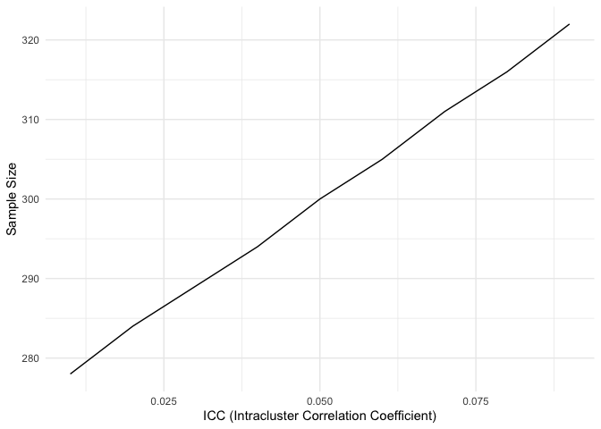

# Load packages

```r
library(tidyverse)
library(ggplot2)
```

# Sample Size calculation, according to "Calculation of sample size for a single cross-sectional cluster survey"
1) Determine the target population: All young women (= potential clients) in Lesotho.
2) Determine estimated proportion of the outcome: We hypothesize that at least 70% of participants are comfortable with being offered any SRH service at the hair salon. Remember, in Bassett et al, J Acquir Immune Defic Syndr, it was over 90%.
3) Determine the level of confidence: 95% confidence. The probability that our sample results will be within the margin of error of the true population estimate. I.e, if we were to repeat our survey 100 times, we would get the same mean result about 95 times.
4) Determine the margin of error (precision): The maximum acceptable difference between our sample estimate and the true population parameter, i.e., how sure we need to be that the results are accurate for the entire population. Usually at around 5% or less. If we discover that 85% of our participating clients find the offer of any SRH service acceptable, we can safely assume that 80-90% of our clients (the total population, i.e. all young women in Lesotho) will accept it.
5) Estimate the intraclass correlation coefficient (ICC): The ICC measures the similarity or correlation between responses within the same cluster. Between 0-1. A higher ICC (closer to 1) implies more similarity, therefore smaller sample size needed (comes closer to an individual randomized trial). Based on the ICC, the design effect (DEFF) is calculated


```r
# Parameters for the sample size calculation
confidence_level <- 0.95 # confidence level
z <- qnorm(1 - (1 - confidence_level) / 2) # z statistic
d <- 0.05 # margin of error
cluster_size <- 3 # Average cluster size (fixed in our case)
icc <- 0.05 # Intracluster correlation coefficient -> 0.05 is generally a safe bet (but see below, plot): https://dcricollab.dcri.duke.edu/sites/NIHKR/KR/Intraclass_Correlation_Coefficient_Cheat_Sheet_March_15_2020.pdf 
prop <- 0.7 # Estimated proportion (= 70% acceptability) -> rather low! The higher, the lower the sample size needed.
deff <- 1 + (cluster_size - 1) * icc # Design Effect
# Calculate the required sample size using the formula: https://mnsurvey.nutritionintl.org/categories/13
sample_size <- ceiling((z * sqrt(prop * (1 - prop)) / d)^2 / deff)
# Print the calculated sample size
cat("Required sample size:", sample_size)
```

```
## Required sample size: 294
```

```r
# Create.a plot varying the ICC
icc_values <- seq(0.01, 0.25, by = 0.01)  # range of realistic ICCs
data_frame <- data.frame(ICC = icc_values)
# Calculate required sample size for each ICC value
data_frame$SampleSize <- ceiling((z * sqrt(prop * (1 - prop)) / d)^2 / (1 + (cluster_size - 1) * data_frame$ICC))
# Create the plot
ss_plot <- ggplot(data_frame, aes(x = ICC, y = SampleSize)) +
  geom_line() +
  labs(
    x = "ICC (Intracluster Correlation Coefficient)",
    y = "Sample Size"
  ) +
  theme_minimal()
print(ss_plot)
```

<!-- -->

```r
# Save the ggplot as an image file (e.g., PNG)
ggsave("sample_size_plot.png", plot = ss_plot, width = 6, height = 4, units = "in")
```

